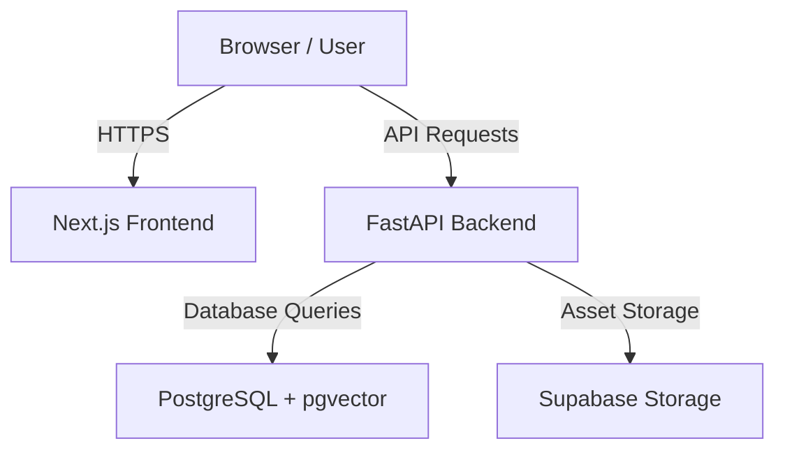

# Ayn Platform: Railway Deployment Guide

This guide explains how to deploy the entire **Ayn Platform** stack (PostgreSQL with `pgvector`, FastAPI Backend, and Next.js Frontend) to Railway.

We have created two service-specific configuration files to automate the deployment:
1. `backend/railway.json` — Builds the backend via the `Dockerfile` and runs database migrations automatically during pre-deployment.
2. `frontend/ayn-landing-page/railway.json` — Builds and deploys the Next.js frontend using Railway's default Nixpacks builder.

---

## Architecture Overview



---

## Step-by-Step Deployment Instructions

### Step 1: Provision the PostgreSQL Database
1. Go to your **Railway Project Dashboard**.
2. Click **+ New** > **Database** > **Add PostgreSQL**.
3. Once the database is ready, go to the **Query** tab inside the database service in the Railway UI and run:
   ```sql
   CREATE EXTENSION IF NOT EXISTS vector;
   ```
   *(This initializes `pgvector` which is required for AI embeddings).*

---

### Step 2: Deploy the FastAPI Backend
1. Click **+ New** > **GitHub Repo** > Select your repository.
2. Go to **Settings** > **General** > **Root Directory** and set it to:
   `/backend`
3. Go to **Settings** > **Config as Code** and make sure the Configuration File path points to:
   `/backend/railway.json`
4. Add the following **Environment Variables** in the **Variables** tab:

| Variable Name | Value / Reference | Description |
| :--- | :--- | :--- |
| `DATABASE_URL` | `${{Postgres.DATABASE_URL}}` | Auto-reference to Railway Postgres |
| `DIRECT_URL` | `${{Postgres.DATABASE_URL}}` | Direct database connection |
| `JWT_SECRET` | *(Generate a secure string)* | Used for session tokens and encryption |
| `JWT_ALGORITHM` | `HS256` | Token signing algorithm |
| `GEMINI_API_KEY` | Your Google Gemini API Key | Required for virtual auditor operations |
| `SUPABASE_URL` | Your Supabase project URL | Storage URL |
| `SUPABASE_KEY` | Your Supabase service key | Storage authentication token |
| `SUPABASE_BUCKET` | `evidence` | Supabase storage bucket name |
| `CORS_ORIGINS` | `https://your-frontend.up.railway.app` | **Change this** to your frontend URL once generated |
| `PORT` | `8000` | Expose the port for the Dockerfile |

*Note: The `preDeployCommand` defined in `backend/railway.json` will automatically run the migrations and seed missing standards when you deploy.*

---

### Step 3: Deploy the Next.js Frontend
1. Click **+ New** > **GitHub Repo** > Select your repository again.
2. Go to **Settings** > **General** > **Root Directory** and set it to:
   `/frontend/ayn-landing-page`
3. Go to **Settings** > **Config as Code** and verify the path points to:
   `/frontend/ayn-landing-page/railway.json`
4. Add the following **Environment Variables** in the **Variables** tab (required before the build starts):

| Variable Name | Value / Reference | Description |
| :--- | :--- | :--- |
| `NEXT_PUBLIC_API_URL` | `https://your-backend-domain.up.railway.app/api` | The deployed backend API endpoint |
| `NEXT_PUBLIC_BACKEND_URL` | `https://your-backend-domain.up.railway.app` | Base URL of the backend |
| `NEXT_PUBLIC_SUPABASE_URL`| Your Supabase project URL | Supabase endpoint |
| `NEXT_PUBLIC_SUPABASE_ANON_KEY` | Your Supabase anon key | Client-side Supabase token |
| `NEXT_PUBLIC_GOOGLE_CLIENT_ID` | *(Optional)* Google OAuth Client ID | Used if Google Sign-In is enabled |

---

### Step 4: Finalize CORS Settings
Once both services are successfully deployed:
1. Copy the public domain generated for your **Frontend** service (e.g., `https://ayn-web.up.railway.app`).
2. Go to your **Backend** service **Variables** tab.
3. Update `CORS_ORIGINS` with this URL.
4. Railway will automatically redeploy the backend with the new configuration.

---

## Troubleshooting & Verification
* **Check Migration Status**: If the backend fails to start, check the deploy logs. The `run_migration.py` script outputs status messages showing if tables were successfully created.
* **Health Check**: Visit `https://your-backend-domain.up.railway.app/health` in your browser. It should return:
  ```json
  {
    "status": "healthy",
    "database": "connected"
  }
  ```
